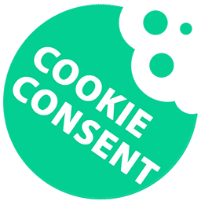
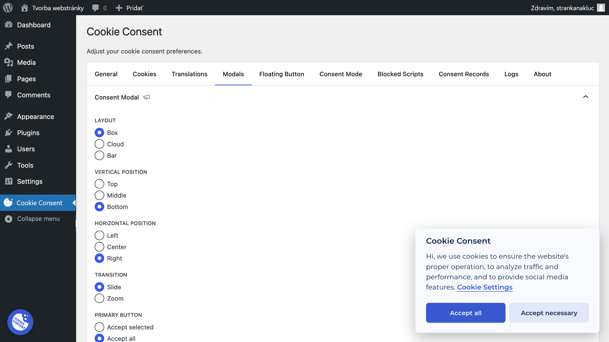
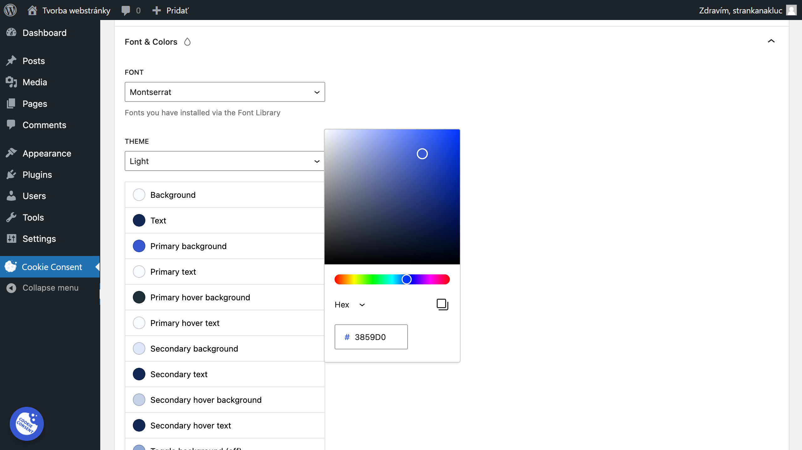

<p align="center">
    
</p>

# Wps Cookie Consent

[](https://wordpress.org/plugins/wps-cookie-consent/)
[](https://wordpress.org/plugins/wps-cookie-consent/)
[](https://wordpress.org/plugins/wps-cookie-consent/)
[](https://wordpress.org/plugins/wps-cookie-consent/)

Wps Cookie Consent uľahčuje pridanie štýlového, prispôsobiteľného bannera súhlasu so súbormi cookie na vašu webovú stránku a podmienené načítanie skriptov tretích strán (analytika, výkon, zacielenie atď.) na základe preferencií vybraných používateľom, ktoré vám pomôžu dodržiavať súbor cookie EÚ GDPR zákon



## Table of Contents

* [Nastavenie](#setup)
* [Vlastnosti](#features)
* [Credity](#credits)
* [Licencia](#license)
* [O Wps](#about-wps)

## Nastavenie

1. Nainštalujte závislosti Composer

 ``` bash
 inštalácia skladateľa
 ```

2. Nainštalujte závislosti npm

 ``` bash
 inštalácia npm
 ```

3. Vytvorte doplnok

 ``` bash
 npm spustiť zostavenie
 ```

4. Nahrajte celý priečinok `wps-cookie-consent` do adresára `wp-content/plugins/`

5. Aktivujte doplnok cez ponuku „Pluginy“ vo WordPress

## Vlastnosti

### Prispôsobiteľný



Jednoduchý a prispôsobiteľný banner súhlasu so súbormi cookie, ktorý pomáha dodržiavať zákon EÚ o súboroch cookie GDPR.

== Popis ==

Wps Cookie Consent uľahčuje pridanie štýlového, prispôsobiteľného bannera súhlasu so súbormi cookie na vašu webovú stránku a podmienené načítanie skriptov tretích strán (analytika, výkon, zacielenie atď.) na základe preferencií vybraných používateľom, ktoré vám pomôžu dodržiavať súbor cookie EÚ GDPR zákon


## Credity

- Postavené na úžasnej [Cookie Consent](https://github.com/orestbida/cookieconsent) knižnici JS od [Orest Bida](https://github.com/orestbida) (licencovaná pod MIT)
- Označenie SVG pomocou [blade-flags](https://github.com/MohmmedAshraf/blade-flags/), ktorý používa [twemoji](https://github.com/twitter/twemoji) (licencované pod MIT)
## Licencia

GNU GPL v2 or later, check the [`LICENSE`](./LICENSE) file.

## O Wps

<p align="center">
    <a href="https://wps.sk/">
        
    </a>
</p>

Toto je doplnok WordPress s otvoreným zdrojom
